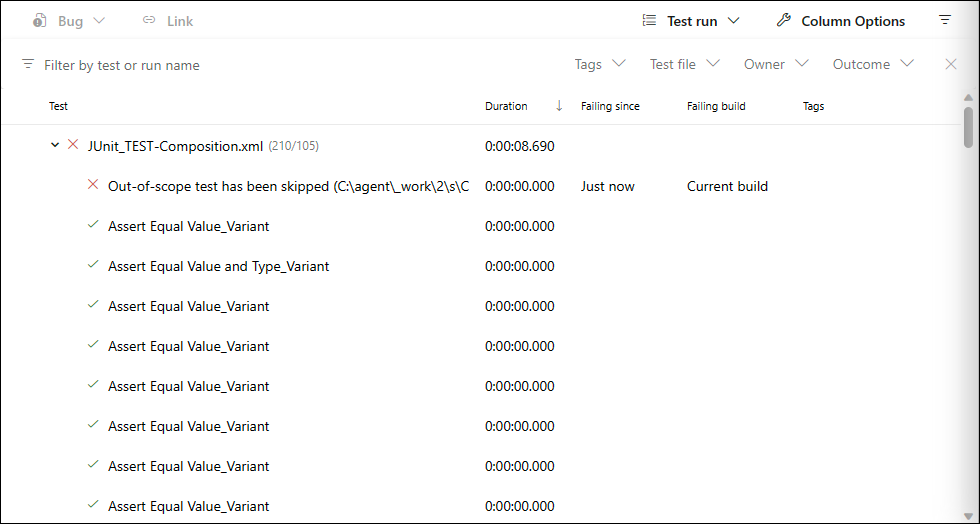
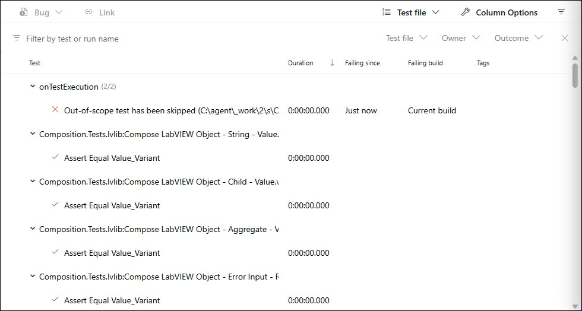
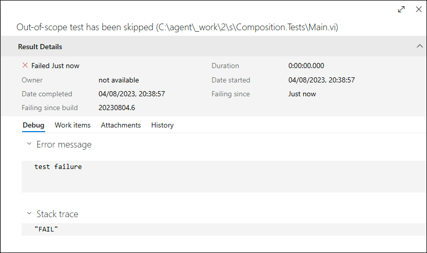
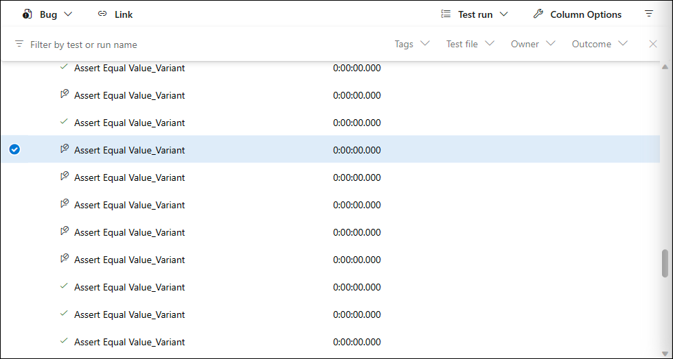
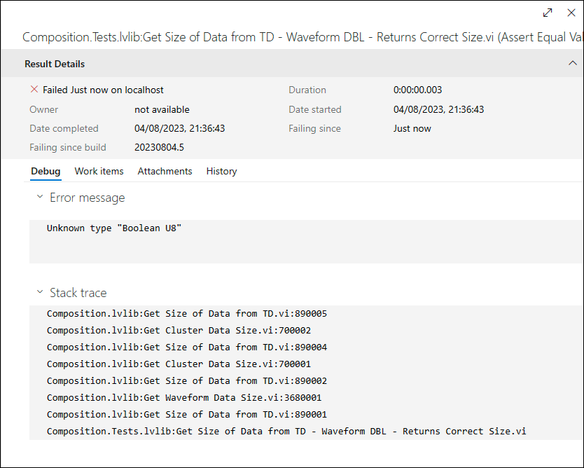
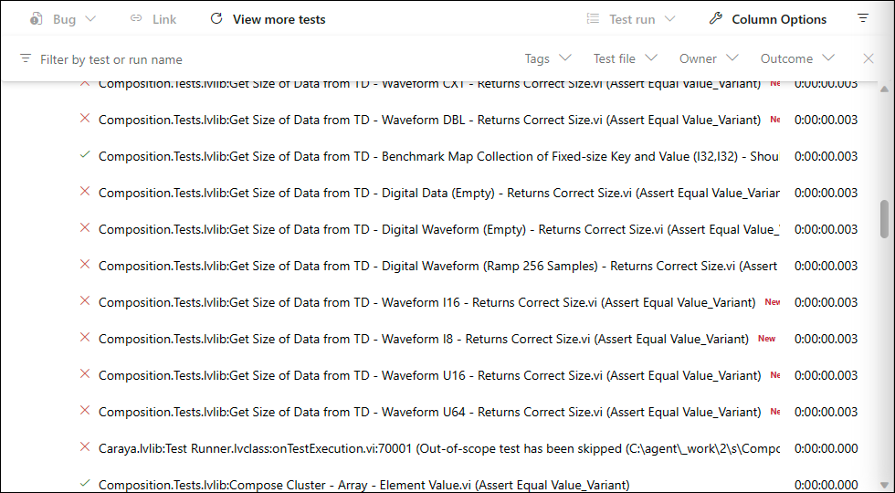
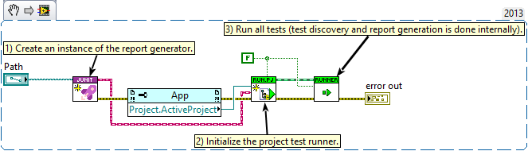

<!-- Based on https://github.com/othneildrew/Best-README-Template -->
<!-- PROJECT SHIELDS -->
<!--
*** I'm using markdown "reference style" links for readability.
*** Reference links are enclosed in brackets [ ] instead of parentheses ( ).
*** See the bottom of this document for the declaration of the reference variables
*** for contributors-url, forks-url, etc. This is an optional, concise syntax you may use.
*** https://www.markdownguide.org/basic-syntax/#reference-style-links
-->
[![Contributors][contributors-shield]][contributors-url]
[![Forks][forks-shield]][forks-url]
[![Stargazers][stars-shield]][stars-url]
[![Issues][issues-shield]][issues-url]
[![BSD-3-Clause License][license-shield]][license-url]

<!-- PROJECT LOGO -->
<br>
<p align="center">
  <a href="https://github.com/logmanoriginal/caraya-junit-for-azure-pipelines">
    
  </a>

  <h3 align="center">Caraya JUnit for Azure Pipelines</h3>

  <p align="center">
    Use Caraya to generate JUnit test reports for Azure Pipelines.
    <br>
    <a href="https://github.com/logmanoriginal/caraya-junit-for-azure-pipelines"><strong>Explore the docs »</strong></a>
    <br>
    <br>
    <a href="https://github.com/logmanoriginal/caraya-junit-for-azure-pipelines">View Demo</a>
    <br>
    <a href="https://github.com/logmanoriginal/caraya-junit-for-azure-pipelines/issues">Report Bug</a>
    <br>
    <a href="https://github.com/logmanoriginal/caraya-junit-for-azure-pipelines/issues">Request Feature</a>
  </p>
</p>

## About The Project

**Caraya JUnit for Azure Pipelines** is an extension for [Caraya](https://github.com/JKISoftware/Caraya) that generates JUnit test reports compatible with [Azure Pipelines](https://learn.microsoft.com/en-us/azure/devops/pipelines/get-started/what-is-azure-pipelines). Test reports are generated according to the [JUnit result format](https://github.com/windyroad/JUnit-Schema) and can be published to Azure Pipelines using the [Publish Test Results v2 task](https://learn.microsoft.com/en-us/azure/devops/pipelines/tasks/reference/publish-test-results-v2).

>_Caraya already includes JUnit support. Why do we need another JUnit extension for Azure Pipelines?_

Here are a few reasons:

- **Azure Pipelines does not display test suites** \
  This is a [known issue](https://github.com/Microsoft/azure-pipelines-tasks/issues/7659) and there is a [suggestion](https://developercommunity.visualstudio.com/t/Support-Test-Suites-of-JUNIT-test-result/10418614) to fix it. Please vote for it :sparkling_heart:

- **Assertion labels are indistinguishable** \
  By default Caraya uses the Assertion VI name when the assertion label is empty (which it is by default). For example, "Assert Equal Value_Variant". This label is not very helpful, especially the in the default view. \
  \
  \
  \
  File view is a little more readable. \
  \
  

- **Test duration for all test cases is zero** \
  By default, the test duration of a test case in Caraya is zero unless the user explicitly monitors the test duration and provides it to the assertion function.

- **Error message and stack trace are meaningless** \
  The default JUnit report produces meaningless error messages and stack traces. A typical failure has the error message "test failure" and stack trace "FAIL". \
  \
  

- **Not executed assertions are reported as skipped** \
  When an error is passed to an assertion function, it is reported as "skipped" in the default JUnit report. That was probably a design decision. Skipped tests, however, do not count towards failed tests in Azure Pipelines. They simply appear under "others" (just like disabled tests). \
  \
  

>_Why not improve the JUnit test report of Caraya?_

I've thought about it and decided against it because the differences introduced by this project would likely be considered breaking changes by other users.

>_How does this project improve test reports in Azure Pipelines?_

This project is build from scratch and aims at providing useful test reports in Azure Pipelines. Here are a few things it improves:

- **Test results are reported with their fully qualified name** \
  This makes the default view much more verbose. \
  \
  

- **Test duration is calculated for every test case** \
  Test duration is calculated from the timestamp of each assertion. User specified test durations still take precedence, of course.

- **Meaningful error messages and stack traces are reported** \
  This extension tries its best to figure out the best error message and stack trace for a failure, based on assertion results and errors. \
  \
  

- **Any failure is considered a failed test** \
  This includes errors passed to an assertion function as well as any error reported by an assertion. Tests are only considered skipped when no error occurred and the assertion was not executed. \
  \
  

### Built With

* [LabVIEW&trade;](https://www.ni.com/labview)

## Getting Started

To get a local copy up and running follow these simple steps.

### Prerequisites

* LabVIEW&trade; 2013 or later
* VI Package Manager

### Installation

1. Clone the repo
   ```sh
   git clone https://github.com/logmanoriginal/caraya-junit-for-azure-pipelines.git
   ```
2. Install packages
   ```sh
   start .vipc
   ```
   Or apply `.vipc` manually.

## Usage

Here is an example that uses the JUnit report generator to create a test report for a project.



## Roadmap

See the [open issues](https://github.com/logmanoriginal/labview-composition/issues) for a list of proposed features (and known issues).

## Contributing

Contributions are what make the open source community such an amazing place to be learn, inspire, and create. Any contributions you make are **greatly appreciated**.

1. Fork the Project
2. Create your Feature Branch (`git checkout -b feature/AmazingFeature`)
3. Commit your Changes (`git commit -m 'Add some AmazingFeature'`)
4. Push to the Branch (`git push origin feature/AmazingFeature`)
5. Open a Pull Request

Keep in mind that LabVIEW&trade; VIs are binary files, which are difficult to merge.
- Only change a single VI or library.
- Avoid conflicts with other pull requests (don't work on the same libraries or VIs).
- Send VI Snippets (via issues) instead of pull requests when possible.

## License

Distributed under the BSD-3-Clause License. See [`LICENSE`](LICENSE.txt) for more information.

## Contact

Project Link: [https://github.com/logmanoriginal/caraya-junit-for-azure-pipelines](https://github.com/logmanoriginal/caraya-junit-for-azure-pipelines)

## Acknowledgements

* [Caraya Unit Test Framework](https://github.com/JKISoftware/Caraya)
* [JUnit-Schema](https://github.com/windyroad/JUnit-Schema)

<!-- MARKDOWN LINKS & IMAGES -->
<!-- https://www.markdownguide.org/basic-syntax/#reference-style-links -->
[contributors-shield]: https://img.shields.io/github/contributors/logmanoriginal/caraya-junit-for-azure-pipelines.svg?style=for-the-badge
[contributors-url]: https://github.com/logmanoriginal/caraya-junit-for-azure-pipelines/graphs/contributors
[forks-shield]: https://img.shields.io/github/forks/logmanoriginal/caraya-junit-for-azure-pipelines.svg?style=for-the-badge
[forks-url]: https://github.com/logmanoriginal/caraya-junit-for-azure-pipelines/network/members
[stars-shield]: https://img.shields.io/github/stars/logmanoriginal/caraya-junit-for-azure-pipelines.svg?style=for-the-badge
[stars-url]: https://github.com/logmanoriginal/caraya-junit-for-azure-pipelines/stargazers
[issues-shield]: https://img.shields.io/github/issues/logmanoriginal/caraya-junit-for-azure-pipelines.svg?style=for-the-badge
[issues-url]: https://github.com/logmanoriginal/caraya-junit-for-azure-pipelines/issues
[license-shield]: https://img.shields.io/github/license/logmanoriginal/caraya-junit-for-azure-pipelines.svg?style=for-the-badge
[license-url]: https://github.com/logmanoriginal/caraya-junit-for-azure-pipelines/blob/master/LICENSE.txt
